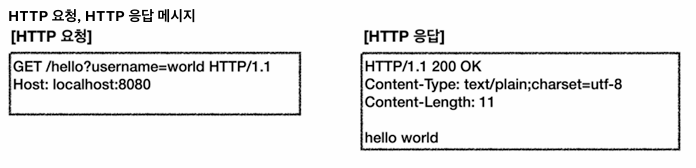
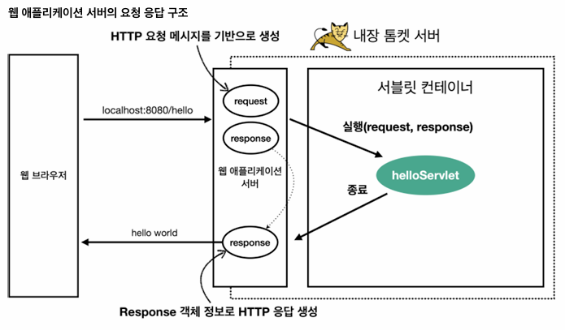

## Sevlet

서버에서 실행되는 자바 프로그램<br>
주로 웹 애플리케이션에서 HTTP 요청과 응답을 처리하는 데 사용<br>


웹 애플리케이션 서버는 `request`, `response`객체를 생성 후 서블릿 컨테이너에 전달<br>
서블릿의 생명 주기는 서블릿 컨테이너가 관리 `init > service > destroy`<br>


- 서블릿 예시
```java
import javax.servlet.ServletException;
import javax.servlet.annotation.WebServlet;
import javax.servlet.http.HttpServlet;
import javax.servlet.http.HttpServletRequest;
import javax.servlet.http.HttpServletResponse;
import java.io.IOException;
import java.io.PrintWriter;

@WebServlet("/hello")
public class HelloServlet extends HttpServlet {

    @Override
    protected void doGet(HttpServletRequest request, HttpServletResponse response)
            throws ServletException, IOException {
        response.setContentType("text/html");
        PrintWriter out = response.getWriter();
        out.println("<html><body>");
        out.println("<h1>Hello, World!</h1>");
        out.println("</body></html>");
    }
}
```
서블릿 객체는 싱글톤으로 관리된다 (미리 만들어 둔다)<br>
스프링 MVC는 서블릿 기반 프레임워크<br>
디스패처 서블릿(DispatcherServlet)이 핵심 역할을 한다<br>
1. HTTP 요청을 디스패처 서블릿이 받음
2. 디스패처 서블릿이 핸들러 매핑 
3. 비즈니스 로직 수행 
4. 모델 데이터를 생성하고, 뷰 이름을 반환 
5. 디스패처 서블릿은 뷰 리졸버를 사용하여 뷰 반환

### DispatcherServlet
서블릿 컨테이너 내부에서 실행된다<br>
스프링 부트에서는 디스패처 서블릿이 자동으로 설정되지만, 기본 스프링 MVC 설정은 다음과 같이 수동으로 설정할 수 있다<br>
- 스프링 MVC를 초기화하고, 디스패처 서블릿을 모든 요청에 매핑<br>
```java
import org.springframework.web.servlet.support.AbstractAnnotationConfigDispatcherServletInitializer;

public class WebAppInitializer extends AbstractAnnotationConfigDispatcherServletInitializer {

    @Override
    protected Class<?>[] getRootConfigClasses() {
        return new Class[] { RootConfig.class };
    }

    @Override
    protected Class<?>[] getServletConfigClasses() {
        return new Class[] { WebConfig.class };
    }

    @Override
    protected String[] getServletMappings() {
        return new String[] { "/" };
    }
}
```

[Back to main README](../README.md)